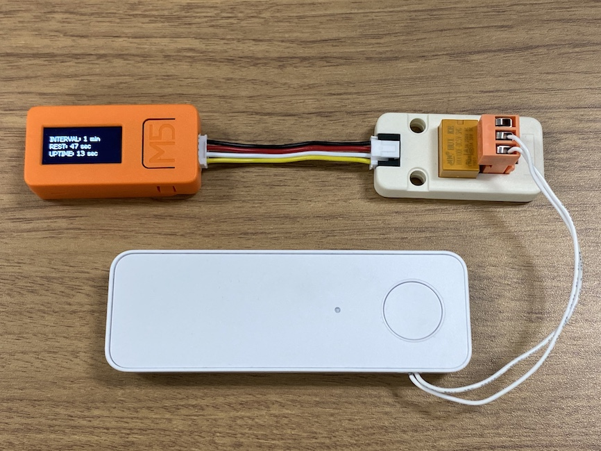
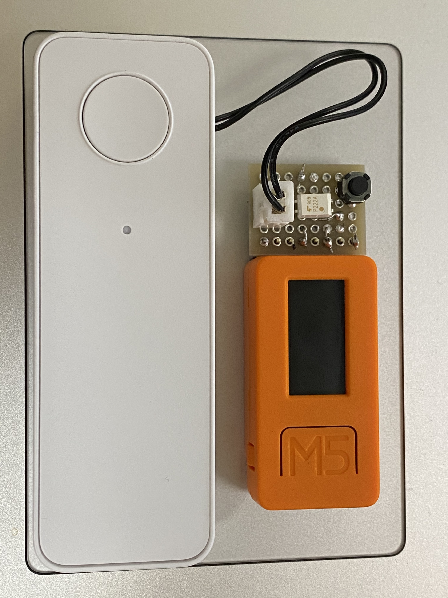

# 公式ワークブック SORACOM実装ガイド 第３部
## 第一章 動態管理 - 簡易トラッキング
**SORACOM LTE-M Button Plus を自動的に押すためのサンプルプログラム**

## 用意するもの

- [M5Stick-C](https://docs.m5stack.com/#/ja/core/m5stickc)
- [リレーユニット](https://docs.m5stack.com/#/ja/unit/relay)
- [SORACOM LTE-M Button Plus](https://soracom.jp/products/gadgets/button_plus/)



## 準備
- [M5stick-C 用のスケッチ](auto-push/auto-push.ino) を Arduino IDE で M5Stick-C に書き込みます
- LTE-M Button と リレーユニットを接続します (ドライバーでケーブルを固定)
- リレーユニットを M5Stick-C に接続します

## 使い方
電源が入ると、送信間隔と、画面には次にボタンを押すまでの秒数、起動してからの経過秒数が表示されます。

- デフォルトでは、１分に１度、リレーが動作してボタンを押したのと同じ動作となります
- また、液晶横のボタンを押すと任意のタイミングでリレーが動作します
- サイドのボタンを押すと、送信間隔を１分・５分・１時間・１日で変更できます

## おまけ
HAT 用端子に下記のような回路を接続すると、より小型の回路でスイッチングできます。

```
                  TLP222AF
+----------+      +---+-+
|       IN <------|3  |2|-----+
|       IN <------|4  |1|-+   |
|          |      +---+-+ |   |
|          |              R   |  R = 200 ohm
|          |              |   |
|          |   +----------+---++
|   LTE-M  |   |5 3 B G G G 5 G|
|  Button  |   |V V A 0 3 2 V N|
|   Plus   |   |I 3 T   6 6 O D|
|          |   +---------------+
|          |   |               |
|          |   |M 5 S t i c k C|
|          |   |               |
```



## パーツリスト
- ユニバーサル基板
- フォトカプラ TLP222AF
- カーボン抵抗 1/6W 200Ω
- 2.54mm ピッチコネクタキット（ベース付ポスト ハウジング コンタクトピン）